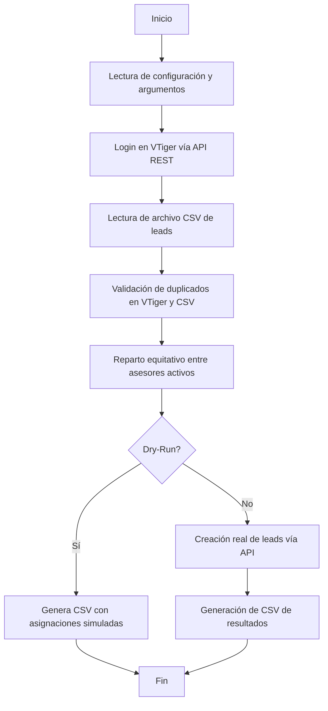
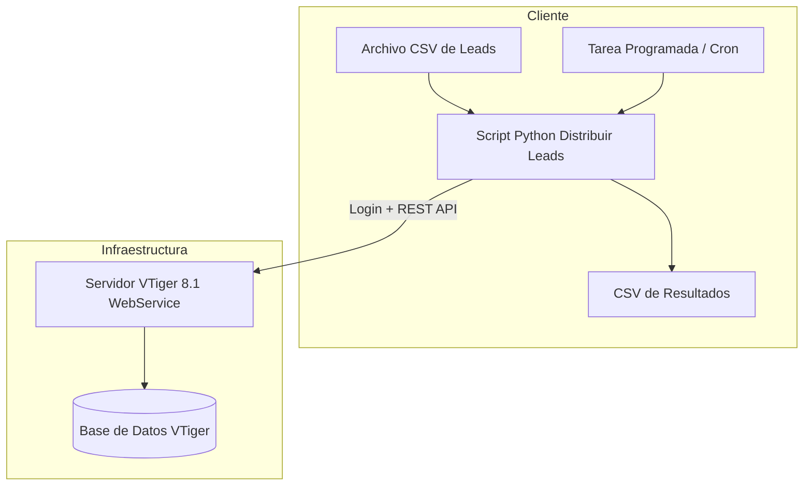

# Documentación Técnica  

## Script: `distribuir_leads_vtiger.py`  

---

### 1. Propósito del Script

Este script automatiza la **distribución de leads** en VTiger 8.1 usando su **API Web (REST/Webservices)**.  

**Funcionalidades principales:**

1. Lectura de un archivo CSV de leads.  
2. Validación de duplicados por email y/o teléfono antes de la creación.  
3. Asignación automática de leads entre asesores activos de manera equitativa.  
4. Respeto de un límite máximo diario de leads por asesor (configurable, por defecto 25).  
5. Creación de los leads en VTiger con usuario asignado.  
6. Generación de un CSV de salida con el detalle de qué leads se crearon, a quién se asignaron y su estado.  
7. Modo **dry-run (simulación)** para verificar la asignación sin modificar datos en el CRM.  

---

### 2. Diseño General del Script

#### 2.1 Esquema funcional



#### 2.2 Módulos y funciones

- **Autenticación:**  
  `login()` usa el flujo `getchallenge` + `login` de VTiger.  
- **Consultas:**  
  `vtiger_query()` permite ejecutar consultas SQL-like con la API.  
- **Validación de duplicados:**  
  `lookup_email_or_phone()` evita crear leads con email/phone existente.  
- **Creación de leads:**  
  `create_record()` crea registros en VTiger.  
- **Asignación:**  
  `repartir_leads()` realiza la lógica de balanceo y creación opcional.  
- **Exportación:**  
  `escribir_csv()` genera un informe de ejecución.  

---

### 3. Funciones y Detalle Técnico

#### 3.1 `get_challenge()`

- **Objetivo:**  
  Obtiene el *challenge token* requerido para el login vía webservice.

- **Argumentos:**  
  Ninguno.

- **Retorno:**  
  `str` con el token challenge.

---

#### 3.2 `login()`

- **Objetivo:**  
  Autenticar contra VTiger y obtener un `sessionName` válido para operaciones posteriores.

- **Argumentos:**  
  Ninguno (usa las constantes `USERNAME` y `ACCESS_KEY`).

- **Retorno:**  
  `str` con `sessionName` de VTiger.

---

#### 3.3 `vtiger_query(session, query)`

- **Objetivo:**  
  Ejecutar una consulta SELECT sobre las tablas de VTiger vía webservice.

- **Argumentos:**  
  - `session` (`str`): token de sesión.  
  - `query` (`str`): consulta VTiger SQL-like (debe terminar con `;`).

- **Retorno:**  
  `list[dict]` con filas de resultados.

---

#### 3.4 `lookup_email_or_phone(session, value, typ='email', modules=None)`

- **Objetivo:**  
  Comprobar si ya existe un lead con un email o teléfono específico.

- **Argumentos:**  
  - `session` (`str`): token de sesión.  
  - `value` (`str`): email o teléfono a buscar.  
  - `typ` (`str`): `"email"` o `"phone"`.  
  - `modules` (`list`): lista de módulos a buscar, ej. `["Leads"]`.

- **Retorno:**  
  `list[dict]` con registros coincidentes (vacío si no existe duplicado).

---

#### 3.5 `create_record(session, module, data)`

- **Objetivo:**  
  Crear un registro en VTiger (usado para Leads).

- **Argumentos:**  
  - `session` (`str`): token de sesión.  
  - `module` (`str`): módulo destino (ej. `"Leads"`).  
  - `data` (`dict`): diccionario con campos a crear (incluye `assigned_user_id`).

- **Retorno:**  
  `dict` con información del registro creado (incluye `id`).

---

#### 3.6 `get_asesores_activos(session)`

- **Objetivo:**  
  Recupera los usuarios activos (asesores) para poder asignar leads.

- **Retorno:**  
  `dict` {`user_id`: `user_name`}.

---

#### 3.7 `contar_leads_hoy_por_asesor(session)`

- **Objetivo:**  
  Contar cuántos leads ha recibido cada asesor en la fecha actual.

- **Retorno:**  
  `dict` {`user_id`: `cantidad` de leads hoy}.

---

#### 3.8 `repartir_leads(session, csv_path, dry_run=True)`

- **Objetivo:**  
  Procesa el CSV de leads, valida duplicados, reparte equitativamente y opcionalmente crea los leads.

- **Argumentos:**  
  - `session` (`str`): sesión de VTiger.  
  - `csv_path` (`str`): ruta al CSV de entrada.  
  - `dry_run` (`bool`): si `True`, no crea leads, solo simula y genera reporte.

- **Retorno:**  
  `list[dict]` con el detalle de cada lead, su asignación y estado (`created`, `planned`, `error`).

---

#### 3.9 `escribir_csv(resultados, salida)`

- **Objetivo:**  
  Generar un archivo CSV con el detalle de leads procesados y su resultado.

- **Argumentos:**  
  - `resultados` (`list[dict]`): salida de `repartir_leads()`.  
  - `salida` (`str`): ruta del CSV de salida.

- **Retorno:**  
  Ninguno (crea el archivo en disco).

---

### 4. Ejecución del Script

El script se puede ejecutar desde la línea de comandos.

#### 4.1 Parámetros

```bash
python distribuir_leads_api_vtiger.py <csv_entrada> [--apply] [--output <csv_salida>]
```

- `<csv_entrada>`: Ruta al CSV con leads.

- `--apply`:

  - Si se incluye, crea los leads en VTiger.

  - Si se omite, ejecuta en **modo simulación** (dry-run).

- `--output <csv_salida>`:

  - Ruta del CSV de salida con resultados (por defecto leads_asignados.csv).

---

#### 4.2 Ejemplos

1. Simulación sin crear leads (verificar asignaciones):

   ```bash
   python distribuir_leads_api_vtiger.py leads_ejemplo_albali.csv
   ```

2. Ejecución real (crea leads en VTiger):

   ```bash
   python distribuir_leads_api_vtiger.py leads_ejemplo_albali.csv --apply
   ```

3. Ejecución con salida personalizada:

   ```bash
   python distribuir_leads_api_vtiger.py leads_ejemplo_albali.csv --apply --output reporte_final.csv
   ```

---

### 5. Formato de Archivos CSV

#### 5.1 Entrada (leads_ejemplo_albali.csv)

Campos requeridos:

```bash
Nombre,Email,Teléfono,Curso Interesado,Fecha entrada,Origen del leads
Juan Pérez,juan.perez@ejemplo.com,600123456,Salud,28/07/2025, Portales
Ana Gómez,ana.gomez@ejemplo.com,600654321,28/07/2025,Electricidad,SEO
```

- Email y Phone se usan para validar duplicados.

- Campos opcionales como Description se pueden incluir.

#### 5.2 Salida (leads_asignados.csv)

Campos generados:

```bash
Nombre,Email,Teléfono,Curso Interesado,AssignedToID,AssignedToName,LeadID,Status
Juan Pérez,juan.perez@ejemplo.com,600123456,Salud,19,asesor.juan,33x1245,created
Ana Gómez,ana.gomez@ejemplo.com,600654321,Electricidad,20,asesor.ana,,planned
```

- `LeadID` vacío si fue solo planeado en dry-run.

- `Status` puede ser:

  - `created` (creado en VTiger)

  - `planned` (simulado en dry-run)

  - `error: <mensaje>` si falló la creación.

---

#### 6. Integración en Entorno del Cliente

1. Requisitos previos:

   - Python 3.8 o superior.

   - Librerías: requests, python-dateutil.

   - Acceso a internet o red interna para alcanzar webservice.php de VTiger.

   - Usuario en VTiger con access key habilitada.

2. Instalación de dependencias:

   ```bash
   pip install requests python-dateutil
   ```

3. Configuración del script:

   - Editar variables:

   ```bash
        VTIGER_URL = "https://crm.albali.com/webservice.php"
        USERNAME = "usuario_api"
        ACCESS_KEY = "clave_de_acceso"
        MAX_LEADS_POR_DIA = 25
   ```

   - Probar primero en dry-run antes de aplicar cambios reales.

4. Integración recomendada:

   - Ejecutar el script como tarea programada (cron en Linux, Programador de tareas en Windows).

   - Depositar el CSV de entrada en una ruta fija (ej. /var/data/leads/).

   - Recoger el CSV de salida para auditoría y seguimiento.

---

### 7. Buenas Prácticas y Consideraciones

- Dry-Run primero: siempre validar asignaciones antes de creación real.

- Control de duplicados: basado en email/phone, puede ajustarse si el negocio requiere otra lógica.

- Revisar límites diarios: ajustar `MAX_LEADS_POR_DIA` según capacidad de asesores.

- Control de errores: el CSV de salida muestra leads que no se pudieron crear.

- Auditoría: conservar el CSV de salida como registro de ejecución.

---

### 8. Diagrama de Despliegue



Descripción del despliegue:

1. El cliente entrega o coloca el CSV de leads en una ubicación conocida.

2. Una tarea programada (cron o equivalente) invoca el script.

3. El script se autentica en VTiger, valida duplicados, reparte y (si se aplica) crea leads.

4. VTiger persiste los leads en su base de datos interna.

5. El script produce un CSV de salida con el resultado de cada lead (creado/omitido/error) para auditoría.

---
