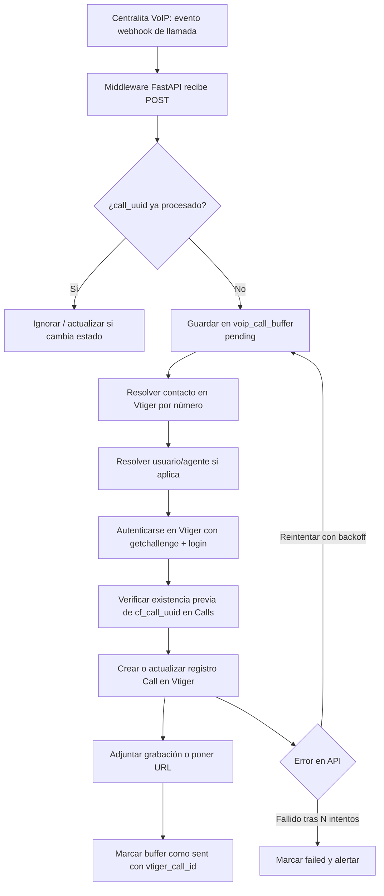
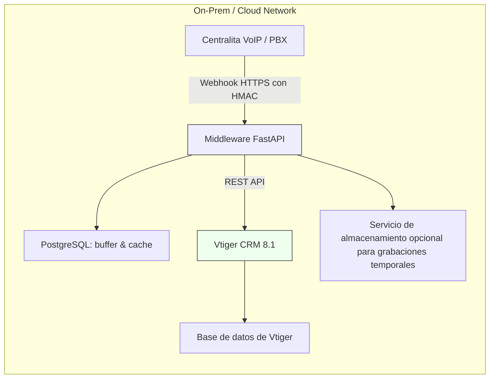

# Integración de centralita VoIP con Vtiger CRM 8.1

**Objetivo:** Registrar automáticamente llamadas (entrantes/salientes) en Vtiger como registros de “Call”, vinculándolas a contactos y usuarios, incluyendo grabaciones.


   - Se usa el módulo estándar “**Calls**” de Vtiger extendido con campos personalizados; no se crea módulo nuevo para mantener compatibilidad y minimizar mantenimiento.

   - Se implementa un **middleware en Python (FastAPI)** como punto único de integración; maneja la recepción de webhooks, normalización, búsqueda de contactos, deduplicación, autenticación y envío a Vtiger.

   - Se elige **PostgreSQL** para el buffer intermedio por fiabilidad y soporte JSONB.

   - Autenticación con Vtiger se hace mediante su API REST `getchallenge` / `login` tradicional.

   - Se garantiza **idempotencia** usando `call_uuid` de la PBX como campo personalizado y clave en buffer.

   - Grabaciones se enlazan como URL y opcionalmente se descargan y adjuntan si expiran (configurable).

   - Seguridad: HTTPS obligatoria, validación HMAC de webhooks, logging estructurado, reintentos exponenciales.

---

## 1. Esquema de datos

#### 1.1 Campos adicionales en Vtiger (Calls)

Agregar los siguientes **campos personalizados** en el módulo **Call** (desde el Layout Editor / Module Manager o con script de extensión):

| Campo interno             | Etiqueta visible        | Tipo       | Uso                                                                 |
|--------------------------|-------------------------|------------|---------------------------------------------------------------------|
| `cf_call_uuid`           | UUID de llamada VoIP    | Texto      | Identificador único de la llamada desde la PBX (idempotencia)       |
| `cf_from_number`         | Número origen           | Texto      | Número que llamó                                                    |
| `cf_to_number`           | Número destino          | Texto      | Número llamado                                                      |
| `cf_recording_url`       | URL de grabación         | URL/Texto  | Enlace a grabación remota                                           |
| `cf_pbx_system`          | Sistema PBX             | Texto      | Identificador de centralita si hay más de una                      |
| `cf_duration_seconds`    | Duración (s)            | Entero    | Duración en segundos                                                |


El resto (subject, description, assigned_user_id, parent_id, status, date_start/time_start) usa los campos estándar.


#### 1.2 Base intermedia (middleware) — PostgreSQL

```sql
CREATE TABLE voip_call_buffer (
  id SERIAL PRIMARY KEY,
  call_uuid VARCHAR UNIQUE NOT NULL,
  raw_payload JSONB NOT NULL,
  status VARCHAR(16) NOT NULL DEFAULT 'pending', -- pending, sent, failed
  retries INT NOT NULL DEFAULT 0,
  last_attempt TIMESTAMP,
  vtiger_call_id VARCHAR,
  created_at TIMESTAMP NOT NULL DEFAULT now()
);

CREATE TABLE number_contact_map (
  id SERIAL PRIMARY KEY,
  phone_number VARCHAR UNIQUE NOT NULL,
  vtiger_contact_id VARCHAR NOT NULL,
  last_verified TIMESTAMP NOT NULL DEFAULT now()
);
```

---

## 2. Diagrama de flujo de llamada



---


## 3. Diagrama de despliegue



---


## 4. Descripción del flujo técnico y despliegue

**1. Centralita VoIP envía webhook:** Cuando se completa o actualiza una llamada, envía un `POST` HTTPS al endpoint del middleware (`/webhook/call`) con JSON: identificador único (`call_uuid`), números `from` y `to`, timestamps, estado, URL de grabación, agente/extensión, etc. El webhook se firma con HMAC usando secreto compartido para validar autenticidad.

**2. Middleware recibe y persiste:**

- Valida firma HMAC.

- Inserta el payload en `voip_call_buffer` si es nuevo.

- Si ya existe (misma `call_uuid`), compara estado y decide si actualizar o ignorar (idempotencia).


**3. Resolución de entidades:**

- Busca el contacto en Vtiger por `from` o `to` con consulta `SELECT * FROM Contacts WHERE phone LIKE '...'` vía API. Usa cache local `number_contact_map` para acelerar si ya se resolvió recientemente.

- Mapea la extensión / agente de la PBX a `assigned_user_id` en Vtiger mediante tabla estática o configuración.

**4. Autenticación en Vtiger:**

- Hace `getchallenge` para obtener token.

- Calcula `accessKey = md5(challenge + user_access_key)`.

- Ejecuta `login` y obtiene `sessionName`.

**5. Creación/actualización de la llamada:**

- Busca si ya existe un Call con `cf_call_uuid igual`; si existe, se puede hacer `update` (p. ej. para cambiar estado o adjuntar grabación).

- Si no existe, crea la llamada con todos los campos.

**6. Adjuntar grabación:**

- Se incluye la URL directamente en campo `cf_recording_url` y en `description`.

- Si la URL expira, el middleware puede descargar temporalmente y adjuntar el MP3 como archivo relacionado (opcional).

**7. Finalización:**

- Si se creó/actualizó bien, se marca el buffer `status='sent'` y se guarda `vtiger_call_id`.

- Si falla, se incrementa contador y se reintenta con backoff; tras X intentos se marca `failed` y se notifica (log/alerta por email o sistema de monitoreo).

---

## 5. Implementación 

#### 5.1 Estructura de proyecto

```arduino
voip_integration/
├── main.py
├── vtiger_client.py
├── db.py
├── config.py
├── security.py
├── models.py
├── utils.py
├── requirements.txt
```


#### 5.2 `config.py`

**Propósito:** centralizar configuración (via `.env` o variables de entorno) de la conexión a Vtiger, base de datos y validación de webhooks.

**Contenido clave:**
- `VTIGER_URL`, `VTIGER_USERNAME`, `VTIGER_ACCESS_KEY` — credenciales y endpoint de la API de Vtiger.
- `WEBHOOK_SECRET` — secreto compartido para validar firmas HMAC de webhooks entrantes.
- Parámetros de PostgreSQL: `DB_HOST`, `DB_PORT`, `DB_NAME`, `DB_USER`, `DB_PASSWORD`.

**Debugging:**
- Si hay errores de autenticación con Vtiger, verificar que `VTIGER_USERNAME` y `VTIGER_ACCESS_KEY` son correctos y que el usuario tiene permisos para crear/actualizar Calls.  
- Errores de conexión a la base: confirmar que las credenciales y host son accesibles desde el middleware. Probar con `psql` manual o un script simple de conexión.  
- Activar `env_file` y revisar con `print(settings.dict())` temporalmente para confirmar carga (no dejar en producción sin sanitizar).


#### 5.3 `security.py`

**Propósito:** validar autenticidad de los webhooks que provienen de la centralita VoIP. Usa HMAC-SHA256 con el secreto compartido.

**Función principal:**
- `verify_hmac_signature(payload_bytes: bytes, signature: str) -> bool`: calcula el HMAC del payload recibido y lo compara con el encabezado `X-Signature` proporcionado.

**Qué hace:**
- Evita que llamadas fraudulentas creen registros en el CRM. Si la firma no coincide, se rechaza el webhook con 401.

**Debugging:**
- Si todos los webhooks son rechazados con 401, verificar:
  - Que el cliente (PBX) usa el mismo secreto (`WEBHOOK_SECRET`).  
  - Que el hash se calcula sobre exactamente los bytes enviados (evitar transformaciones como re-serializar JSON con cambios de orden).  
  - Loguear temporalmente el `expected` vs el `received` hash en entornos de prueba.  
- Asegurarse de que el header usado en el envío coincide (ej. `X-Signature`) y no hay mayúsculas/minúsculas alteradas por proxies.


#### 5.4 `db.py`

**Propósito:** abstracción mínima de conexión a PostgreSQL y operaciones básicas de buffer.

**Qué contiene / hace:**
- Conexión mediante `psycopg2` a la base de datos.  
- Función de ayuda como `get_conn()` para obtener `psycopg2.connect(...)`.  
- Ejemplo de inserción en buffer (`voip_call_buffer`) para guardar el webhook recibido con su `call_uuid` y estado inicial.

**Debugging:**
- Si no se insertan filas en `voip_call_buffer`:  
  - Confirmar que el esquema SQL se ejecutó (crear tablas).  
  - Verificar permisos del usuario DB.  
  - Hacer una consulta directa con `psql` para ver contenido:  
    ```sql
    SELECT * FROM voip_call_buffer ORDER BY created_at DESC LIMIT 10;
    ```  
- Si hay bloqueos o excepciones: habilitar logs de conexión y revisar excepciones completas (puede envolver con try/except y loguear traceback durante pruebas).

---

#### 5.4 `vtiger_client.py`

**Propósito:** encapsula la interacción con la API web de Vtiger (login, query, create, update).

**Funciones clave:**
- `login()`: obtiene el challenge, calcula la accessKey, y realiza login para conseguir `sessionName`.  
- `query(soql)`: ejecuta consultas SOQL.  
- `create(element_type, element)`: crea un nuevo registro (ej. Call).  
- `update(element_type, element)`: actualiza un registro existente.

**Detalles importantes:**
- Se espera que `element` se serialice como JSON string en el cuerpo.  
- Manejador de errores: usa `raise_for_status()` en llamadas HTTP; si Vtiger responde con error, se lanza excepción.

**Debugging:**
- Si falla login: inspeccionar la respuesta cruda de `getchallenge` y `login`; imprimir `r.text` durante pruebas.  
- Si las queries no devuelven resultados esperados: verificar la sintaxis SOQL, especialmente comillas y escapes en filtros de número de teléfono.  
- Si la creación/actualización falla, revisar el payload JSON que se envía y compararlo con lo que Vtiger exige en su API (nombres de campos personalizados deben coincidir exactamente, p. ej. `cf_call_uuid`).  
- Activar logs con contenido de `call_element` antes de crear/actualizar.

---

#### 5.5 `main.py`

**Propósito:** corazón del middleware. Recibe el webhook, valida, normaliza, resuelve contacto/usuario, y llama a Vtiger para crear o actualizar el registro de llamada. Maneja buffer y status.

**Responsabilidades:**
1. Recibir webhook (`/webhook/call`).  
2. Validar firma HMAC.  
3. Parsear JSON y calcular duración si se tiene inicio/fin.  
4. Insertar en `voip_call_buffer` si es nuevo.  
5. Autenticarse en Vtiger y resolver contacto por número.  
6. Construir el objeto `Call` con campos estándar y personalizados (ej. `cf_call_uuid`, `cf_recording_url`).  
7. Buscar por `cf_call_uuid` para idempotencia; crear o actualizar según corresponda.  
8. Marcar el buffer con `sent` o `failed` y guardar `vtiger_call_id`.

**Debugging:**
- Si no se crea la llamada en Vtiger:  
  - Verificar en los logs qué paso falló (login, query, create).  
  - Revisar si se encontró un contacto incorrectamente (o no se resolvió).  
  - Asegurarse de que el payload entrante contiene `call_uuid` y formato de fechas esperados.  
- Si las llamadas se duplican: comprobar que el campo `cf_call_uuid` está presente en Vtiger y que la consulta de existencia (`SELECT * FROM Calls WHERE cf_call_uuid = '...'`) devuelve correctamente antes de crear.  
- Verificar actualizaciones de estado en `voip_call_buffer` (`sent` vs `failed`) para entender si el procesamiento fue exitoso.  
- Añadir temporalmente logging detallado (`logger.debug`) con los valores intermedios: `from`, `to`, `direction`, `call_element`.

---

#### 5.6 Firma HMAC del webhook (componente externo)
  
ejemplo de código que **debe ejecutarse en la centralita VoIP / sistema emisor** para firmar cada webhook antes de enviarlo. Garantiza que el receptor pueda verificar que el payload no fue alterado y proviene de la fuente esperada.

**Script de firma:**
- Toma el JSON de la llamada.  
- Calcula un HMAC-SHA256 usando el secreto compartido (`WEBHOOK_SECRET`).  
- Inserta el hash como header (`X-Signature`) en la petición HTTP hacia el middleware.

**Ejemplo práctico (puede colocarse como `sign_and_send.py` en el sistema de la PBX):**

```python
import hmac
import hashlib
import requests
import json

WEBHOOK_URL = "https://middleware.example.com/webhook/call"
SECRET = "supersecreto123"  # Debe coincidir con WEBHOOK_SECRET en el middleware

payload = {
    "call_uuid": "uuid-555",
    "from": "+34123456789",
    "to": "+34900112233",
    "direction": "inbound",
    "start_time": "2025-08-02T14:00:00Z",
    "end_time": "2025-08-02T14:02:30Z",
    "status": "completed",
    "recording_url": "https://pbx.example.com/recordings/uuid-555.mp3",
    "agent_ext": "1001",
    "pbx_system": "centralita1"
}
payload_bytes = json.dumps(payload).encode()
signature = hmac.new(SECRET.encode(), payload_bytes, hashlib.sha256).hexdigest()

headers = {
    "Content-Type": "application/json",
    "X-Signature": signature
}

response = requests.post(WEBHOOK_URL, data=payload_bytes, headers=headers)
print("Status:", response.status_code)
print("Response:", response.text)
```

**Debugging en el emisor (PBX):**

- Validar que el JSON enviado y el que se usa para calcular HMAC son exactamente iguales (sin reordenar claves).

- Verificar que el header X-Signature llega intacto (proxies pueden alterar mayúsculas o truncar).

- Si el middleware responde 401, loguear el HMAC calculado y pedir que se compare con el esperado allí para diagnóstico.